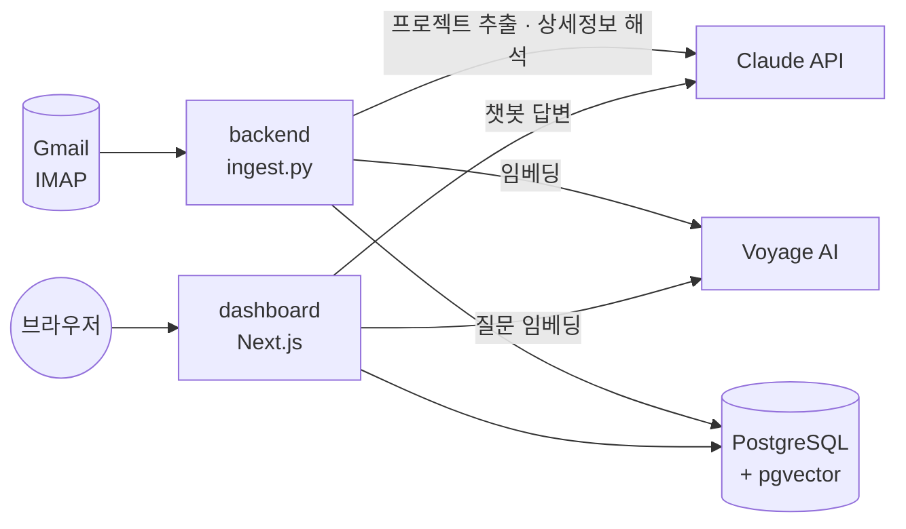

# 구인 메일 Agent (job_email_agent)

매일 오는 구인 추천 메일(원티드긱스)을 자동으로 읽어 **프로젝트 단위로 구조화**하고, 상세 페이지까지 따라가 조건(예상금액·기간·근무지·모집 종료 여부)을 채운 뒤, **의미 기반 검색(RAG)·일일 리포트·웹 대시보드·챗봇**으로 보여주는 프로젝트입니다.

`docker compose up` 한 줄로 PostgreSQL(pgvector) · 백엔드 · 대시보드가 함께 기동됩니다.

## 주요 기능

- **메일 수집·필터링**: Gmail IMAP으로 최근 N일 이내 안 읽은 메일을 조회하고, 제목 규칙으로 개인 맞춤 추천 메일만 선별
- **멀티 프로젝트 추출**: 메일 1통에 나열된 여러 프로젝트를 LLM으로 배열 추출
- **상세 페이지 수집**: 각 프로젝트의 "더 알아보기" 링크를 따라가 예상금액·시작일·기간·근무지·모집 종료 여부를 LLM으로 해석
- **의미 기반 검색(RAG)**: Voyage AI 임베딩을 pgvector에 저장하고 코사인 유사도로 검색
- **일일 리포트**: 모집 중인 최근 공고를 핵심 요약 + 상세 리포트(마크다운)로 생성
- **웹 대시보드**: 공고 목록, 상태 버튼(관심/보류/거절), 삭제, RAG 기반 질의응답 챗봇
- **자동 수집**: macOS launchd로 매일 정해진 시각에 수집 실행 (Docker Desktop이 꺼져 있으면 자동으로 켬)

## 아키텍처



| 서비스 | 이미지 | 역할 |
|---|---|---|
| `db` | `pgvector/pgvector:pg16` | 공고·임베딩 저장. 데이터는 `pgdata` 볼륨에 영구 보관. 호스트 포트 5433 |
| `backend` | `python:3.12-slim` 기반 | 메일 수집→파싱→임베딩→저장. **한 번 실행하고 종료되는 작업형** |
| `dashboard` | `node:24-slim` 멀티 스테이지 | Next.js 대시보드 + API. 호스트 포트 3000 |

## 기술 스택

Python 3.12 · imapclient · BeautifulSoup · psycopg2 · Claude API(Anthropic) · Voyage AI(`voyage-4-lite`, 512차원) · PostgreSQL 16 + pgvector(HNSW, 코사인) · Next.js 16 · TypeScript · Tailwind CSS · Docker Compose

## 빠른 시작 (Docker)

### 사전 준비

- Docker Desktop
- Gmail: 2단계 인증 + **앱 비밀번호** 발급, Gmail 설정에서 **IMAP 사용**
- Anthropic API 키, Voyage AI API 키

### 폴더 구조

`docker-compose.yml`이 `../job_dashboard`를 빌드하므로, 두 프로젝트를 **같은 부모 폴더에 나란히** 둡니다.

```
부모폴더/
├── job_email_agent/   # 이 저장소 (백엔드 + compose)
└── job_dashboard/     # Next.js 대시보드
```

### 실행

```bash
cd job_email_agent
cp .env.example .env        # 값 채우기 (아래 설정 표 참고)
docker compose up --build
```

- 처음에는 이미지 빌드로 수 분 걸립니다.
- 대시보드: <http://localhost:3000>
- `backend`는 시작할 때 메일을 한 번 수집하고 `exited with code 0`으로 끝납니다. 정상입니다.
- 백그라운드 실행: `docker compose up -d`

## 자주 쓰는 명령

```bash
docker compose ps                                            # 상태
docker compose logs -f dashboard                             # 로그
docker compose run --rm backend                              # 메일 수집 다시 실행
docker compose run --rm backend python daily_report.py       # 일일 리포트 (reports/ 폴더에 저장)
docker compose run --rm backend python search.py "여의도 Java"   # 의미 기반 검색
docker compose stop                                          # 중지 (데이터 유지)
docker compose down                                          # 컨테이너 삭제 (데이터 유지)
docker compose down -v                                       # 볼륨(DB 데이터)까지 삭제 — 주의
```

코드를 수정한 뒤에는 `docker compose up -d --build`로 이미지를 다시 만들어야 반영됩니다.

## 자동 수집 (macOS, launchd)

매일 정해진 시각에 `scripts/run_ingest.sh`가 실행됩니다. Docker Desktop이 꺼져 있으면 켜고 준비될 때까지 기다린 뒤 `docker compose run --rm backend`로 메일을 수집하며, 결과는 `logs/ingest.log`에 시각과 함께 남습니다.

```bash
bash scripts/install_launchd.sh              # 매일 06:00에 등록
bash scripts/install_launchd.sh 7 30         # 매일 07:30으로 변경 (시 분)
bash scripts/install_launchd.sh --uninstall  # 해제
launchctl kickstart -k gui/$(id -u)/com.jobagent.ingest   # 지금 바로 실행
```

- 실패하면(네트워크가 아직 연결되지 않은 경우 등) 60초 간격으로 최대 3회 재시도합니다.
- 맥이 잠자기 상태였다면 깨어날 때 실행됩니다. 전원이 꺼져 있던 시간의 실행은 건너뜁니다.
- 로그인된 상태에서만 실행되는 사용자 LaunchAgent입니다.

## 설정 값 (`.env`)

| 변수 | 설명 |
|---|---|
| `GMAIL_ADDRESS`, `GMAIL_APP_PASSWORD` | Gmail 주소와 앱 비밀번호(16자리, 공백 없이) |
| `SENDER_FILTER` | 대상 발신 도메인. 콤마로 여러 개 가능 (기본 `wantedlab.com`) |
| `RECIPIENT_NAME` | 제목에 들어 있는 본인 이름. `(광고)`와 이 이름이 모두 있는 메일만 처리 |
| `LOOKBACK_DAYS` | 최근 며칠 이내 메일만 조회 (기본 14) |
| `ANTHROPIC_API_KEY` | Claude API 키 |
| `VOYAGE_API_KEY` | Voyage AI 키 (임베딩) |
| `REPORT_LOOKBACK_DAYS`, `MY_SKILLS` | 일일 리포트 대상 기간, 보유 스킬(매칭 코멘트에 참고) |
| `DB_USER`, `DB_PASSWORD`, `DB_NAME` | 비워 두면 compose 기본값(`jobagent` / `jobagent` / `job_agent`) 사용 |

`.env`에는 비밀 값이 들어 있으므로 저장소에 올리지 않습니다(`.gitignore`, `.dockerignore`로 제외). API 키는 이미지에 포함되지 않고 실행 시 주입되며, 대시보드 컨테이너에는 필요한 키(Anthropic, Voyage, DB)만 전달됩니다.

## 데이터베이스

- 최초 기동 시 `db/init/001_schema.sql`이 자동 적용됩니다 (`migration_002~005`를 합친 최종 스키마).
- 공고는 `(email_message_id, project_index)`로 중복 저장이 방지됩니다. 같은 메일을 다시 처리해도 중복되지 않습니다.
- 대시보드의 **삭제는 소프트 삭제**(`deleted_at` 기록)입니다. 행이 남아 있어야 같은 메일을 다시 처리해도 삭제한 공고가 되살아나지 않으며, 목록·챗봇·검색·리포트에서는 제외됩니다.
- DB는 호스트 5433 포트로도 접속할 수 있습니다 (로컬에 PostgreSQL이 5432를 쓰고 있어도 충돌하지 않도록 분리).

기존 로컬 DB의 데이터를 옮기려면 DB 컨테이너만 먼저 띄운 뒤 데이터를 주입합니다.

```bash
docker compose up -d db
pg_dump -d job_agent --data-only --table=job_postings > /tmp/job_postings_data.sql
docker compose exec -T db sh -c 'psql -U "$POSTGRES_USER" -d "$POSTGRES_DB"' < /tmp/job_postings_data.sql
```

## 문제 해결

| 증상 | 원인과 조치 |
|---|---|
| `Cannot connect to the Docker daemon` | Docker Desktop이 꺼져 있음 → `open -a Docker` 후 1~2분 대기 |
| `invalid environment variable: =...` | `.env`에 `변수=값` 형식이 아닌 줄이 있음 → `grep -nv -E '^[A-Za-z_][A-Za-z0-9_]*=\|^#\|^$' .env`로 해당 줄 확인 |
| 포트 3000 또는 5433 충돌 | 이미 사용 중인 프로세스를 종료하거나 `docker-compose.yml`의 포트를 변경 |
| backend의 IMAP 접속 시간 초과 | 네트워크가 993 포트를 차단(공용 와이파이 등). 다른 네트워크에서 실행. db·dashboard는 영향 없음 |
| 챗봇 응답 없음 | `docker compose logs dashboard`에서 API 키·DB 연결 오류 확인 |

## 설계 메모와 제약

- **파이프라인 구조**: 실행 순서는 코드로 고정되어 있고, LLM은 추출·해석·요약·답변 단계에서 호출됩니다. 스스로 계획을 세우고 도구를 고르는 자율 에이전트는 아닙니다.
- **원티드긱스 전용 규칙**: 제목 필터(`(광고)`+이름)와 "더 알아보기" 링크 추출은 원티드긱스 메일 형식에 맞춘 것입니다. 다른 사이트는 `ingest.py`의 `is_target_subject`, `extract_more_info_links`에 사이트별 규칙을 추가해 확장합니다(`DOMAIN_TO_SITE`에 매핑 포함).
- **상세 페이지**: 로그인 없이 접근 가능한 페이지만 수집합니다.
- **임베딩 호출**: 메일 1통의 프로젝트를 한 번의 API 호출로 묶어 처리합니다(요청 수 제한 대응).
- **수집 실행**: launchd가 매일 정해진 시각에 `docker compose run --rm backend`를 실행합니다. 수동 실행도 같은 명령입니다.
- 검증 환경: macOS(Intel) + Docker Desktop.

## 프로젝트 구조

```
job_email_agent/
├── ingest.py                # 메일 수집·파싱·임베딩·저장
├── search.py                # 의미 기반 검색 (CLI)
├── daily_report.py          # 일일 브리핑 리포트 생성
├── backfill_embeddings.py   # 임베딩이 없는 기존 데이터 일괄 생성
├── Dockerfile
├── docker-compose.yml
├── db/init/001_schema.sql   # DB 최초 기동 시 적용되는 통합 스키마
├── scripts/
│   ├── run_ingest.sh        # launchd가 호출하는 수집 래퍼 (Docker 기동 대기·재시도·로그)
│   └── install_launchd.sh   # launchd 등록/해제
├── migration_00*.sql        # 단계별 스키마 변경 이력
├── requirements.txt
└── .env.example
```

대시보드(`job_dashboard`): `src/app/page.tsx`(목록·버튼), `src/app/api/postings`(조회·상태·삭제), `src/app/api/chat`(RAG 챗봇), `src/components/ChatBox.tsx`.

## 향후 계획

- 잡코리아 등 다른 구인 사이트 지원
- 테스트 코드와 CI/CD
